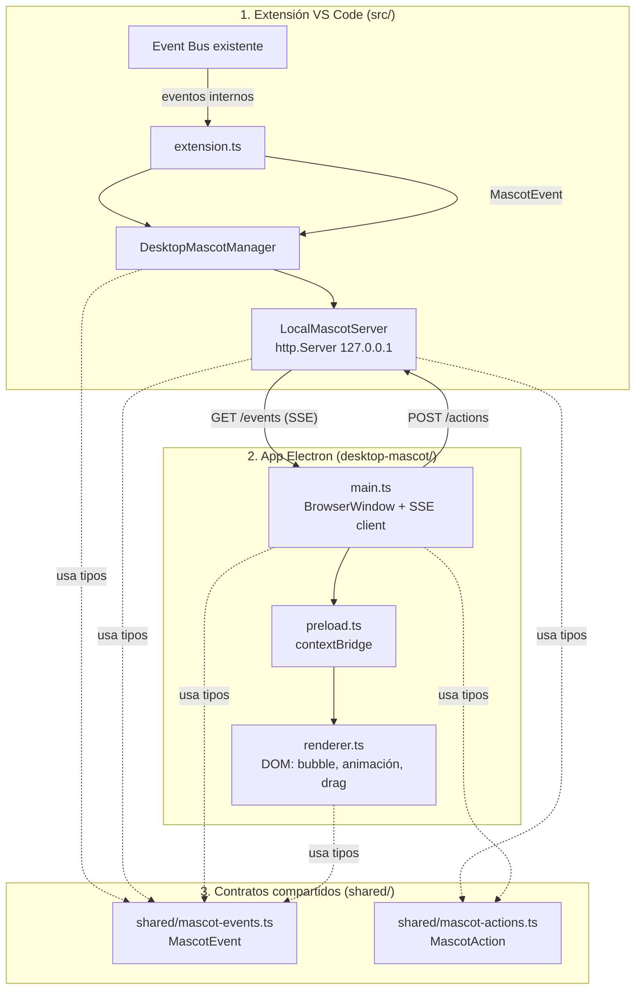
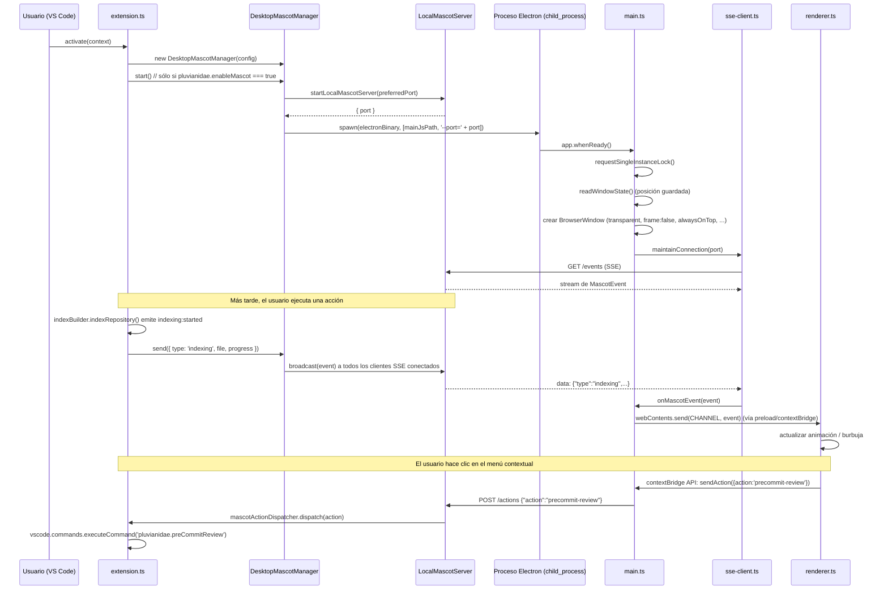

# Design Document: Desktop Mascot (Electron)

## Overview

Este feature convierte la mascota de Pluvianidae de un panel dentro de una webview del editor (`src/presentation/mascot/mascot-webview.ts`) a una **aplicación de escritorio Electron independiente**, siempre visible por encima de VS Code y de cualquier otra aplicación, arrastrable y persistente entre sesiones.

La extensión sigue siendo la única fuente de verdad sobre "qué le pasa a la mascota" (indexación, hallazgos, semillas, errores). La app Electron es un renderer tonto: recibe eventos, los pinta, y expone un puñado de acciones explícitas (menú contextual) de vuelta a la extensión. Toda la comunicación entre ambos procesos pasa por un contrato compartido (`shared/`) y un servidor HTTP local que sólo escucha en `127.0.0.1`.

Se mantienen sin romper: `indexer`, `searcher`, `reference-analyzer`, `dead-code-detector`, `frontend-backend-comparator`, `pre-commit-reviewer` (+ `secret-detector`), `readme-generator`, `explainer`. Ninguno de estos módulos cambia su comportamiento; sólo se les añade, en `extension.ts`, un envío adicional de eventos hacia la mascota de escritorio.

## Architecture

Tres piezas con límites claros, cada una con una única responsabilidad:



**Límites entre las tres piezas:**

1. **Extensión VS Code (`src/`)** — Nunca importa nada de Electron. Sólo conoce `DesktopMascotManager` como interfaz. Si Electron no está instalado o falla, la extensión sigue funcionando (ver "Manejo de fallos").
2. **App Electron (`desktop-mascot/`)** — Paquete npm independiente, con su propio `package.json`, `tsconfig.json` y ciclo de compilación. No importa nada de `src/` de la extensión. Sólo conoce los tipos de `shared/`.
3. **Contratos compartidos (`shared/`)** — Sin dependencias de `vscode` ni de `electron`. Es el único lugar donde se define la forma de los mensajes. Ambas piezas lo importan por ruta relativa; no se duplica ningún tipo.

## Components and Interfaces

### Componente 1: `DesktopMascotManager` (`src/services/desktop-mascot-manager.ts`)

**Purpose**: Fachada pública que la extensión usa para controlar el ciclo de vida completo de la mascota de escritorio, sin que ningún otro módulo de la extensión conozca detalles de Electron ni del transporte HTTP.

**Interface**:
```typescript
class DesktopMascotManager {
  constructor(options: { preferredPort: number });
  start(): Promise<void>;
  stop(): Promise<void>;
  show(): Promise<void>;
  hide(): Promise<void>;
  send(event: MascotEvent): Promise<void>;
  dispose(): Promise<void>;
}
```

**Responsibilities**:
- Orquestar `LocalMascotServer` y el proceso hijo de Electron.
- Mantener la máquina de estados (`idle`/`starting`/`running`/`stopping`/`stopped`/`unavailable`).
- Garantizar fail-safe: nunca lanzar excepciones hacia `extension.ts`.

### Componente 2: `LocalMascotServer` (`src/services/local-mascot-server.ts`)

**Purpose**: Encapsula el servidor `http.Server` local (SSE + `/actions`), sin conocer nada de Electron ni de la lógica de negocio de la extensión.

**Interface**:
```typescript
interface LocalMascotServer {
  start(preferredPort: number): Promise<{ port: number }>;
  broadcast(event: MascotEvent): void;
  onAction(handler: (action: MascotAction) => void): Disposable;
  stop(): Promise<void>;
}
```

**Responsibilities**:
- Escuchar exclusivamente en `127.0.0.1`.
- Autodetectar puerto libre ante `EADDRINUSE`.
- Validar cada mensaje entrante/saliente con los type guards de `shared/`.

### Componente 3: `MascotActionDispatcher` (`src/services/mascot-action-dispatcher.ts`)

**Purpose**: Traduce cada `MascotAction` recibido (ya validado) a exactamente un comando de VS Code o efecto local del manager, vía tabla estática (nunca ejecución dinámica).

**Interface**:
```typescript
interface MascotActionDispatcher {
  dispatch(action: MascotAction): Promise<void>;
}
```

### Componente 4: App Electron — `main.ts` / `preload.ts` / `renderer.ts` (`desktop-mascot/src/`)

**Purpose**: Proceso Electron independiente que renderiza la ventana flotante, mantiene la conexión SSE (`sse-client.ts`), persiste la posición (`window-state.ts`) y construye el menú contextual (`context-menu.ts`).

**Interface** (API expuesta por `preload.ts` al `renderer` vía `contextBridge`):
```typescript
interface PluvianidaeMascotApi {
  onMascotEvent(callback: (event: MascotEvent) => void): void;
  sendAction(action: MascotAction): void;
}
```

**Responsibilities**:
- Nunca exponer APIs de Node/Electron más allá de `PluvianidaeMascotApi`.
- Renderizar animaciones/burbujas usando siempre `textContent`.
- Implementar el singleton lock de proceso (`app.requestSingleInstanceLock()`).

## Data Models

### `MascotEvent` (existente, `shared/mascot-events.ts`) — extensión → mascota

```typescript
type MascotEvent =
  | { type: 'idle' }
  | { type: 'indexing'; file?: string; progress?: number }
  | { type: 'success'; message: string }
  | { type: 'warning'; message: string }
  | { type: 'error'; message: string }
  | { type: 'seed'; amount: number }
  | { type: 'hide' }
  | { type: 'show' };
```

**Validation Rules**:
- `type` debe ser uno de los 8 literales; cualquier otro valor es rechazado.
- `message` (en `success`/`warning`/`error`): string no vacío, máximo `MASCOT_EVENT_MAX_TEXT_LENGTH` (2000) caracteres.
- `progress` (en `indexing`): número finito entre 0 y 100.
- `amount` (en `seed`): entero positivo, máximo 1000.
- Ningún objeto puede tener campos adicionales a los definidos para su `type` (rechazo estricto, ver `isMascotEvent`).

### `MascotAction` (nuevo, `shared/mascot-actions.ts`) — mascota → extensión

```typescript
type MascotAction =
  | { action: 'analyze-repository' }
  | { action: 'precommit-review' }
  | { action: 'show-seed-basket' }
  | { action: 'mute-messages' }
  | { action: 'hide-mascot' }
  | { action: 'close-mascot' };
```

**Validation Rules**:
- `action` debe ser uno de los 6 literales de `MASCOT_ACTION_TYPES`.
- El objeto no puede tener ningún campo adicional a `action` (sin parámetros de texto libre; elimina superficie de inyección).

### `WindowPosition` (nuevo, interno a `desktop-mascot/src/window-state.ts`)

```typescript
interface WindowPosition {
  x: number;
  y: number;
}
```

**Validation Rules**:
- `x`/`y` deben ser números finitos.
- La posición sólo se usa si cae dentro del área de trabajo de al menos uno de `screen.getAllDisplays()`; en caso contrario se descarta a favor de la posición por defecto (esquina inferior derecha del display primario).

## Estructura de carpetas

Estructura final propuesta (basada en la del usuario, con ajustes justificados abajo):

```pascal
Pluvianidae/
  src/                                  // extensión VS Code (existente)
    extension.ts
    services/
      desktop-mascot-manager.ts         // NUEVO — clase pública DesktopMascotManager
      local-mascot-server.ts            // NUEVO — servidor HTTP local (SSE + /actions)
      mascot-action-dispatcher.ts       // NUEVO — mapea MascotAction -> vscode.commands
    presentation/mascot/                // existente, sin romper
      mascot-controller.ts
      animation-engine.ts
      mascot-webview.ts                 // se deja en desuso, no se borra (ver decisión abajo)

  desktop-mascot/                       // NUEVO — app Electron independiente
    package.json                        // dependencias propias (electron, electron-builder opcional)
    tsconfig.json                       // rootDir incluye ../shared para importar tipos sin copiarlos
    src/
      main.ts                           // BrowserWindow, ciclo de vida, singleton lock
      preload.ts                        // contextBridge, única API expuesta al renderer
      renderer.ts                       // DOM: animaciones, burbujas, drag, menú contextual
      sse-client.ts                     // NUEVO — cliente SSE propio + reconexión (testable)
      window-state.ts                   // NUEVO — persistencia de posición de ventana
      ipc-channels.ts                   // NUEVO — nombres de canal IPC como constantes
      context-menu.ts                   // NUEVO — construcción del menú contextual (allowlist)
    assets/
      mascot.png                        // o se reutiliza el emoji actual (🐦), sin arte nuevo
    index.html
    styles.css

  shared/
    mascot-events.ts                    // existente — MascotEvent (extensión -> mascota)
    mascot-actions.ts                   // NUEVO — MascotAction (mascota -> extensión)
```

**Diferencias frente a la estructura propuesta por el usuario, y por qué:**

| Diferencia | Justificación |
|---|---|
| Se añaden `sse-client.ts`, `window-state.ts`, `ipc-channels.ts`, `context-menu.ts` dentro de `desktop-mascot/src/` en vez de todo en `main.ts`/`renderer.ts` | Sigue el patrón ya usado en el resto del repo (un archivo = una responsabilidad, p. ej. `indexer/file-discovery.ts`, `indexer/symbol-extractor.ts`). Facilita probar la lógica de reconexión y persistencia de posición de forma aislada, sin un `BrowserWindow` real. |
| Se añade `shared/mascot-actions.ts` en vez de meter las acciones dentro de `mascot-events.ts` | `mascot-events.ts` documenta explícitamente que `MascotEvent` es un flujo unidireccional extensión→mascota. Las acciones del menú contextual van en la dirección opuesta (mascota→extensión). Mezclarlas en el mismo archivo/tipo rompería esa garantía documentada y la exhaustividad del type guard existente (`isMascotEvent`). Un archivo hermano mantiene "una sola fuente de verdad por dirección de mensaje", sin duplicar nada. |
| Se añaden `desktop-mascot-manager.ts`, `local-mascot-server.ts`, `mascot-action-dispatcher.ts` como archivos separados en `src/services/` en vez de una sola clase grande | Igual razón: `DesktopMascotManager` es la fachada pública (ciclo de vida), `LocalMascotServer` es el detalle de transporte (HTTP/SSE), `mascot-action-dispatcher.ts` es el mapeo acción→comando VS Code. Mantiene cada pieza testeable por separado, igual que `PreCommitReviewer` delega en `SecretDetector`/`SecretCommitGate`. |
| `mascot-webview.ts` se mantiene, no se elimina | Ver sección "Decisión sobre `mascot-webview.ts`". |

## Contratos compartidos (`shared/`)

### `shared/mascot-events.ts` (existente, conciliado)

El archivo ya existente **coincide exactamente** con el contrato pedido por el usuario. Se reutiliza sin cambios:

```typescript
export type MascotEvent =
  | { type: 'idle' }
  | { type: 'indexing'; file?: string; progress?: number }
  | { type: 'success'; message: string }
  | { type: 'warning'; message: string }
  | { type: 'error'; message: string }
  | { type: 'seed'; amount: number }
  | { type: 'hide' }
  | { type: 'show' };
```

Ya incluye `isMascotEvent` (type guard exhaustivo), `serializeMascotEvent`, `deserializeMascotEvent` y límites de longitud de texto. Este feature **no modifica este archivo**, sólo lo consume desde `LocalMascotServer` (extensión) y `sse-client.ts`/`renderer.ts` (Electron).

### `shared/mascot-actions.ts` (nuevo)

Contrato para la dirección mascota→extensión, con la misma disciplina de allowlist cerrada y type guard exhaustivo que `mascot-events.ts`:

```typescript
/** Acciones explícitamente permitidas desde el menú contextual de la mascota. */
export type MascotAction =
  | { action: 'analyze-repository' }
  | { action: 'precommit-review' }
  | { action: 'show-seed-basket' }
  | { action: 'mute-messages' }
  | { action: 'hide-mascot' }
  | { action: 'close-mascot' };

export const MASCOT_ACTION_TYPES = [
  'analyze-repository',
  'precommit-review',
  'show-seed-basket',
  'mute-messages',
  'hide-mascot',
  'close-mascot',
] as const;

export function isMascotAction(value: unknown): value is MascotAction {
  if (typeof value !== 'object' || value === null) return false;
  const record = value as Record<string, unknown>;
  return (
    typeof record.action === 'string' &&
    (MASCOT_ACTION_TYPES as readonly string[]).includes(record.action) &&
    Object.keys(record).length === 1
  );
}

export function serializeMascotAction(action: MascotAction): string {
  return JSON.stringify(action);
}

export function deserializeMascotAction(raw: string): MascotAction | undefined {
  let parsed: unknown;
  try {
    parsed = JSON.parse(raw);
  } catch {
    return undefined;
  }
  return isMascotAction(parsed) ? parsed : undefined;
}
```

No hay ningún campo de texto libre ni parámetros: cada acción es un átomo cerrado, lo que hace la validación trivial y elimina cualquier superficie de inyección de comandos.

## Protocolo de comunicación

### Transporte elegido: servidor HTTP local + Server-Sent Events, sin dependencias nuevas

**Decisión final:** un único `http.Server` de Node (módulo `http` nativo, sin paquetes externos) corre dentro del proceso de la extensión, escuchando exclusivamente en `127.0.0.1`, con dos endpoints:

- `GET /events` — flujo SSE (`text/event-stream`) de `MascotEvent`, extensión → mascota. La app Electron implementa su **propio** cliente SSE (`desktop-mascot/src/sse-client.ts`), leyendo el stream con `http.request` (no con el `EventSource` del navegador — ver alternativas rechazadas) para que la lógica de reconexión sea código nuestro, testeable con Vitest/fast-check.
- `POST /actions` — cuerpo JSON `MascotAction`, mascota → extensión. Un solo mensaje por request, sin streaming.

```pascal
FORMATO DE MENSAJE (ambas direcciones)
  Content-Type: application/json (POST /actions)
  Content-Type: text/event-stream, cada evento como:
    "data: " + JSON.stringify(MascotEvent) + "\n\n"

VALIDACIÓN (en ambos extremos, nunca confiar en el otro proceso)
  1. Parsear JSON. Si falla -> descartar mensaje, loggear, seguir.
  2. Pasar por isMascotEvent(...) / isMascotAction(...).
  3. Si no pasa el type guard -> descartar mensaje, loggear, seguir.
  4. Nunca usar eval/Function/require dinámico sobre contenido recibido.
```

**Puerto:** configurable vía `pluvianidae.mascotPort` (default `0` = autodetectar). Algoritmo de arranque del servidor:

```pascal
ALGORITHM startLocalMascotServer(preferredPort)
INPUT: preferredPort: number  // 0 significa "autodetectar"
OUTPUT: { server: http.Server, port: number }

BEGIN
  ASSERT preferredPort >= 0 AND preferredPort <= 65535

  server ← http.createServer(requestHandler)

  TRY
    actualPort ← listen(server, host = '127.0.0.1', port = preferredPort)
  CATCH EADDRINUSE
    // Puerto ocupado (probablemente por otra ventana de VS Code con
    // Pluvianidae activo) -> pedir uno libre al SO, nunca reintentar el
    // mismo puerto en bucle.
    actualPort ← listen(server, host = '127.0.0.1', port = 0)
  END TRY

  ASSERT server.listening = true
  ASSERT actualPort > 0

  writePortFile(actualPort)  // ver "Descubrimiento de puerto" abajo
  RETURN { server, port: actualPort }
END
```

**Descubrimiento de puerto por la app Electron:** el puerto resuelto se escribe en un archivo pequeño (`path.join(app.getPath('userData'), 'pluvianidae-mascot-port.json')` del lado Electron; del lado extensión, `path.join(context.globalStorageUri.fsPath, 'mascot-port.json')` — mismo valor, escrito por la extensión y leído por Electron al arrancar, pasado también como argumento de línea de comandos al spawnear el proceso (`--port=<n>`) para evitar una carrera de lectura antes de que el archivo exista). El argumento de línea de comandos es la fuente primaria; el archivo es sólo un respaldo para reconexión si el proceso Electron se reinicia solo.

**Reconexión automática** (código propio en `sse-client.ts`, no delegado a ningún runtime):

```pascal
ALGORITHM maintainConnection(port)
INPUT: port: number
OUTPUT: (efecto secundario: emite MascotEvent validados al llamador)

SEQUENCE
  backoffMs ← INITIAL_BACKOFF_MS   // p. ej. 500
  LOOP
    TRY
      connectSse('http://127.0.0.1:' + port + '/events')
      ON eachEvent DO
        event ← deserializeMascotEvent(rawData)
        IF event IS NOT undefined THEN
          backoffMs ← INITIAL_BACKOFF_MS   // éxito -> resetear backoff
          onMascotEvent(event)
        END IF
      END ON
      AWAIT connectionClosed
    CATCH connectionError
      log(connectionError)
    END TRY

    AWAIT sleep(backoffMs)
    backoffMs ← min(backoffMs * 2, MAX_BACKOFF_MS)   // p. ej. tope 10000
  END LOOP
END SEQUENCE
```

**Precondiciones:** `port` es un entero válido conocido antes de llamar (vía argv o archivo de puerto).
**Postcondiciones:** cada `MascotEvent` válido recibido se entrega exactamente una vez a `onMascotEvent`; ningún mensaje inválido llega a `onMascotEvent`; una caída de conexión nunca detiene el bucle de reintento (no hay `return`/`throw` que escape del `LOOP`).
**Invariante de bucle:** en cada iteración, `backoffMs` está acotado entre `INITIAL_BACKOFF_MS` y `MAX_BACKOFF_MS`.

### Evitar múltiples servidores / múltiples procesos Electron

- **Servidor único:** `DesktopMascotManager.start()` es idempotente — si ya hay un servidor escuchando (tracking interno de estado), una segunda llamada no crea otro. Si el puerto preferido está ocupado por *otro* proceso (otra ventana de VS Code), se autodetecta uno libre (ver algoritmo arriba) en vez de fallar.
- **Proceso Electron único:** dentro de `desktop-mascot/src/main.ts`, se usa `app.requestSingleInstanceLock()` (API nativa de Electron, ya probada por el propio framework) — si el lock falla, el proceso recién lanzado hace `app.quit()` inmediatamente. Esto cubre el caso de que `DesktopMascotManager.start()` se invoque dos veces por error (p. ej. dos Extension Development Host apuntando al mismo `userData`).

## Flujo de procesos

Cómo se lanza Electron desde la extensión, y ciclo de vida completo de un mensaje:



## Ciclo de vida

`DesktopMascotManager` expone exactamente la interfaz pedida por el usuario:

```typescript
class DesktopMascotManager {
  start(): Promise<void>;
  stop(): Promise<void>;
  show(): Promise<void>;
  hide(): Promise<void>;
  send(event: MascotEvent): Promise<void>;
  dispose(): Promise<void>;
}
```

### Especificación formal de cada método

**`start()`**
- *Precondiciones:* `pluvianidae.enableMascot === true` (si es `false`, el llamador —`extension.ts`— no debe invocar `start()` en absoluto; ver "Respeto de `enableMascot`"). Ningún servidor/proceso propio ya en ejecución para esta instancia del manager.
- *Postcondiciones:* si Electron está disponible e inicia correctamente, el servidor local está escuchando y el proceso Electron fue spawneado. Si Electron **no** está disponible o falla al iniciar (binario no encontrado, `spawn` lanza error, el proceso hijo emite `error`/sale con código distinto de 0 antes de confirmar arranque), `start()` **no lanza** — resuelve normalmente tras loggear el fallo en el `OutputChannel` de la extensión, y el manager queda en estado `unavailable` (fail-safe).
- *Efectos secundarios:* ninguno visible para el resto de la extensión si falla (ningún módulo existente depende de que la mascota exista).

**`stop()`**
- *Precondiciones:* ninguna (idempotente; llamar sobre un manager ya detenido es un no-op seguro).
- *Postcondiciones:* el proceso Electron hijo (si existe) recibió señal de terminación y `stop()` no resuelve hasta que el proceso hijo emitió su evento `exit` o venció un timeout de gracia (p. ej. 3000ms), tras el cual se envía `kill('SIGKILL')` como último recurso. El servidor local local se cierra (`server.close()`), liberando el puerto.

**`show()` / `hide()`**
- *Precondiciones:* ninguna.
- *Postcondiciones:* equivalen a `send({ type: 'show' })` / `send({ type: 'hide' })` — la ventana Electron nunca se destruye por esto, sólo se oculta/muestra (`BrowserWindow.hide()`/`show()` en `main.ts`, disparado por el evento recibido). Si el manager está en estado `unavailable`, son no-ops seguros.

**`send(event)`**
- *Precondiciones:* `isMascotEvent(event)` es verdadero (el propio manager valida antes de serializar — nunca confía en que el llamador ya validó).
- *Postcondiciones:* si el manager está `running`, el evento se difunde a todos los clientes SSE conectados (normalmente uno). Si está `unavailable` o `stopped`, `send()` resuelve sin efecto (no lanza, no bloquea al llamador — ningún módulo de análisis debe fallar por culpa de la mascota).

**`dispose()`**
- *Precondiciones:* ninguna.
- *Postcondiciones:* equivalente a `stop()`, y además libera cualquier listener registrado por `wireDesktopMascotToEventBus` (ver Integración). Seguro de llamar múltiples veces. Es lo que `extension.ts` registra en `context.subscriptions`, garantizando que `deactivate()` limpia todo.

### Máquina de estados del manager

```pascal
ESTADOS: 'idle' | 'starting' | 'running' | 'stopping' | 'stopped' | 'unavailable'

idle        --start()-->        starting
starting    --éxito-->          running
starting    --fallo-->          unavailable   // fail-safe, sin excepción
running     --stop()/dispose()--> stopping
stopping    --proceso terminado--> stopped
unavailable --start()-->        starting      // permite reintentar manualmente
stopped     --start()-->        starting
```

**Invariante:** en los estados `idle`, `unavailable` y `stopped`, no existe ni servidor HTTP escuchando ni proceso hijo vivo. Esto es lo que garantiza "no quedan procesos Electron huérfanos".

### Limpieza garantizada de recursos

En `stop()`/`dispose()`, en este orden:

```pascal
1. Cancelar cualquier timer pendiente (heartbeat, reconexión propia si el manager tuviera cliente).
2. server.close() -> libera el puerto y cierra todas las conexiones SSE abiertas.
3. childProcess.kill('SIGTERM'); esperar 'exit' con timeout de gracia.
4. Si no salió a tiempo -> childProcess.kill('SIGKILL').
5. Eliminar el archivo de puerto (best-effort, no crítico si falla).
6. Marcar estado = 'stopped'.
```

Adicionalmente, como defensa en profundidad contra huérfanos si la extensión muere sin llamar `dispose()` (p. ej. crash del proceso de VS Code): el lado Electron implementa un **heartbeat** — si `sse-client.ts` pasa más de `HEARTBEAT_TIMEOUT_MS` (p. ej. 30000ms) sin recibir ningún evento *ni* poder reconectar exitosamente, asume que la extensión ya no existe y llama `app.quit()` por sí mismo.

## Ventana Electron

Configuración de `BrowserWindow` en `main.ts` (todos los valores pedidos explícitamente por el usuario):

```typescript
const win = new BrowserWindow({
  width: 260,
  height: 240,
  x: initialPosition.x,
  y: initialPosition.y,
  frame: false,
  transparent: true,
  alwaysOnTop: true,
  skipTaskbar: true,
  resizable: false,
  maximizable: false,
  minimizable: false,
  hasShadow: false,
  webPreferences: {
    preload: path.join(__dirname, 'preload.js'),
    contextIsolation: true,
    nodeIntegration: false,
  },
});
win.setAlwaysOnTop(true, 'screen-saver'); // por encima de la mayoría de apps, incluidas fullscreen
```

**Posición inicial:** calculada con `screen.getPrimaryDisplay().workArea`, esquina inferior derecha:

```pascal
initialX ← workArea.x + workArea.width  - WINDOW_WIDTH  - MARGIN
initialY ← workArea.y + workArea.height - WINDOW_HEIGHT - MARGIN
```

usada sólo si no hay posición guardada previamente (ver siguiente sección).

**Arrastre y persistencia de posición** (`window-state.ts`):

- La ventana no tiene barra de título (`frame:false`), así que el arrastre se implementa vía CSS (`-webkit-app-region: drag` en el contenedor raíz del `renderer`, excluyendo la burbuja de texto y el ícono de menú con `-webkit-app-region: no-drag` para que sigan siendo clicables).
- En `main.ts`, el evento `win.on('moved', ...)` dispara un guardado **debounced** (p. ej. 500ms tras el último `moved`) de `{ x, y }` a `path.join(app.getPath('userData'), 'window-position.json')`.
- Al arrancar, `window-state.ts` intenta leer ese archivo; si existe y contiene coordenadas válidas (números finitos, dentro de algún display conectado), se usan; si no, se cae al cálculo de esquina inferior derecha de arriba. Nunca se confía ciegamente en el archivo (podría estar corrupto o referir a un monitor ya desconectado) — se valida contra `screen.getAllDisplays()` antes de usarlo, y si la posición guardada queda fuera de todos los displays actuales, se descarta y se usa el cálculo por defecto.

## Estados visuales y animaciones

v1 usa el emoji ya usado por la mascota existente (🐦) o el asset actual — sin arte nuevo. Mapeo estado → clase CSS (mismo patrón que `mascot-webview.ts`'s `animationClassFor`, reimplementado en `desktop-mascot/styles.css` porque es un documento HTML distinto, no una duplicación de lógica de negocio):

| Estado | Animación CSS | Disparado por `MascotEvent` |
|---|---|---|
| idle | respiración suave (`scale` 1 ↔ 1.03, loop) | `{ type: 'idle' }` |
| thinking | inclinación leve (`rotate` ±6deg, loop) | (interno: mientras se espera respuesta tras una acción del menú) |
| working | saltos pequeños (`translateY`, loop) | `{ type: 'indexing' }` |
| success | semillas cayendo (ver burbuja) | `{ type: 'success' }` |
| warning | vibración breve (`translateX` shake) | `{ type: 'warning' }` |
| error | sobresalto (`scale` spike + shake) | `{ type: 'error' }` |
| sleeping | opacidad reducida (`opacity: 0.4`) | `{ type: 'hide' }` (visualmente, antes de ocultarse del todo) |

## Burbujas

- Elemento pequeño, posicionado sobre la mascota, con `max-width` fijo y `text-overflow: ellipsis` para el truncado visual.
- El texto completo del mensaje se pone en el atributo `title` (tooltip nativo del navegador) del mismo elemento.
- **Regla de seguridad no negociable:** el `renderer.ts` escribe el mensaje siempre con `element.textContent = message`, nunca con `innerHTML`. Esto es válido tanto para `MascotEvent` de tipo `success`/`warning`/`error` (campo `message`) como para el nombre de archivo de `indexing` (campo `file`).
- Las burbujas se auto-ocultan tras un tiempo fijo (p. ej. 4000ms) mediante un `setTimeout`, sin bloquear la cola de animaciones.
- No se crea ningún panel oscuro grande; la burbuja es una etiqueta pequeña adyacente a la mascota (≈ ancho de la ventana menos márgenes).

## Menú contextual y allowlist de acciones

Menú nativo de Electron (`Menu.buildFromTemplate` en `context-menu.ts`), mostrado con clic derecho sobre la ventana. Lista **cerrada** de acciones (idéntica a `MascotAction`):

```pascal
MENÚ CONTEXTUAL
  "Analizar repositorio"        -> { action: 'analyze-repository' }
  "Revisión pre-commit"         -> { action: 'precommit-review' }
  "Mostrar cesto de semillas"   -> { action: 'show-seed-basket' }
  "Silenciar mensajes"          -> { action: 'mute-messages' }
  "Ocultar mascota"             -> { action: 'hide-mascot' }
  "Cerrar mascota"              -> { action: 'close-mascot' }
```

Cada `click` del menú llama a la API expuesta por `preload.ts` (`window.pluvianidae.sendAction(action)`), que hace IPC hacia `main.ts`, que valida con `isMascotAction` **antes** de hacer el `POST /actions` hacia la extensión. La extensión, en `mascot-action-dispatcher.ts`, vuelve a validar con el mismo type guard antes de mapear a un comando de VS Code — nunca se ejecuta código arbitrario ni se interpola el valor de `action` en ningún comando; el mapeo es una tabla estática:

```pascal
'analyze-repository'  -> vscode.commands.executeCommand('pluvianidae.explainRepository')
'precommit-review'    -> vscode.commands.executeCommand('pluvianidae.preCommitReview')
'show-seed-basket'    -> vscode.commands.executeCommand('pluvianidae.seedBasket.focus')
'mute-messages'       -> desktopMascotManager silencia bubbles localmente (no reenvía MascotEvent de texto hasta que el usuario reactive); no requiere comando VS Code
'hide-mascot'         -> desktopMascotManager.hide()
'close-mascot'        -> desktopMascotManager.stop()
```

`hide-mascot` y `close-mascot` se resuelven íntegramente del lado del manager (no requieren ida y vuelta al servidor HTTP más que la notificación de la acción); `mute-messages` es un flag local en el manager que, mientras esté activo, evita llamar `send()` para eventos `success`/`warning`/`error` (pero sigue reenviando `hide`/`show`/`seed`/`indexing`, que son de estado, no de mensaje).

## Integración con la extensión

### `DesktopMascotManager` y respeto de `enableMascot`

```typescript
const config = loadConfig(); // ya existente en extension.ts
let desktopMascotManager: DesktopMascotManager | undefined;

if (config.enableMascot) {
  desktopMascotManager = new DesktopMascotManager({ preferredPort: config.mascotPort ?? 0 });
  context.subscriptions.push({ dispose: () => void desktopMascotManager?.dispose() });
  void desktopMascotManager.start(); // fire-and-forget; fail-safe internamente
}
```

Si `pluvianidae.enableMascot` es `false`, **no se construye siquiera** `DesktopMascotManager`, ni se intenta `spawn` de ningún binario de Electron — cumpliendo literalmente "ni siquiera se debe intentar iniciar Electron".

### `wireDesktopMascotToEventBus` — mapeo de eventos internos a `MascotEvent`

Función pura nueva, análoga a `wireMascotToEventBus` (mascota de webview) pero apuntando al `DesktopMascotManager`:

```pascal
EVENTO INTERNO (Event Bus / comando)              MascotEvent ENVIADO
  indexing:started                                { type: 'indexing', progress: 0 }
  indexing:progress                                { type: 'indexing', file: currentFile, progress: current/total*100 }
  indexing:completed                               { type: 'success', message: 'Indexación completa (<N> archivos)' }
  analysis:finding (dead-code-detector)            { type: 'warning', message: finding.description }
  analysis:finding (frontend-backend-comparator)   { type: 'warning', message: finding.description }
  analysis:finding (pre-commit secreto detectado)  { type: 'error', message: 'Se detectó un posible secreto en <file>' }
  precommit:completed { hasErrors: false }         { type: 'success', message: 'Revisión pre-commit sin errores' }
  precommit:completed { hasErrors: true }          { type: 'warning', message: 'Revisión pre-commit con hallazgos' }
  seed:created                                     { type: 'seed', amount: <semillas creadas en este lote> }
  error no controlado en cualquier handler          { type: 'error', message: describeError(err) }
```

Esta tabla vive en un único módulo (`src/services/mascot-event-mapper.ts`, función pura, testeable sin `vscode`), consumido por `wireDesktopMascotToEventBus`. Ningún módulo existente (`indexer`, `dead-code-detector`, etc.) cambia su forma de emitir — sólo se añade este listener adicional en `extension.ts`, igual que ya existe el listener de la mascota-webview.

### Manejo de fallos de Electron (fail-safe)

```pascal
ALGORITHM DesktopMascotManager.start()
BEGIN
  IF NOT config.enableMascot THEN
    RETURN   // nunca llega aquí si el llamador respeta enableMascot, pero es defensa adicional
  END IF

  TRY
    { server, port } ← startLocalMascotServer(config.preferredPort)
    childProcess ← spawnElectronProcess(port)
    AWAIT confirmChildStartedOrTimeout(childProcess, STARTUP_TIMEOUT_MS)
    state ← 'running'
  CATCH anyError
    log('[Pluvianidae] Mascota de escritorio no disponible: ' + describeError(anyError))
    state ← 'unavailable'
    // NO relanzar. NO mostrar error bloqueante al usuario (a lo sumo un
    // mensaje informativo de una sola vez, no repetido en cada análisis).
  END TRY
END
```

Todo `send()`/`show()`/`hide()` posterior comprueba `state === 'running'` primero y es un no-op silencioso en cualquier otro estado — ningún flujo existente (indexación, pre-commit, etc.) queda bloqueado ni lanza si Electron no arrancó.

## Seguridad

| Punto | Cómo se cubre |
|---|---|
| `nodeIntegration: false`, `contextIsolation: true` | Configurado explícitamente en `BrowserWindow` (ver sección Ventana Electron). |
| `contextBridge` para API mínima | `preload.ts` expone únicamente `window.pluvianidae = { onMascotEvent(cb), sendAction(action) }` vía `contextBridge.exposeInMainWorld`. Ninguna referencia a `require`, `process`, ni APIs de Node llega al `renderer`. |
| Validación de IPC preload/main/renderer | `sendAction` valida con `isMascotAction` en el propio `preload.ts` antes de reenviar al `main`; `main.ts` vuelve a validar antes de hacer el `POST /actions`. `onMascotEvent` sólo reenvía objetos que ya pasaron `isMascotEvent` en `sse-client.ts`. |
| Validación de mensajes externos (HTTP/SSE) | Todo `data:` recibido por `sse-client.ts` pasa por `deserializeMascotEvent` (JSON.parse + `isMascotEvent`); todo `POST /actions` recibido por `local-mascot-server.ts` pasa por `deserializeMascotAction`. Mensajes inválidos se descartan y se loggean; nunca se hace `eval`/`Function`/ejecución dinámica sobre el contenido. |
| Sólo localhost | `server.listen(port, '127.0.0.1')` — nunca `0.0.0.0` ni `undefined` (que en Node equivale a todas las interfaces). Se documenta explícitamente en el código con un comentario para que nadie lo cambie por error en el futuro. |
| Allowlist de acciones del menú contextual | `MascotAction` es una unión cerrada de 6 literales; `isMascotAction` rechaza cualquier otro valor. El menú contextual sólo puede generar estos 6 valores (no hay entrada de texto libre en el menú). |
| Limpieza de sockets/listeners/timers/procesos hijos | Ver "Limpieza garantizada de recursos" en Ciclo de vida. |
| Rutas de Windows | Todas las rutas se construyen con `path.join(...)` (nunca concatenación de strings) — aplica a `preload` path, archivo de posición, archivo de puerto, `userData`. |
| **Nota de seguridad — sin autenticación entre procesos** | El servidor HTTP local **no implementa autenticación** entre la extensión y el proceso Electron: cualquier proceso corriendo bajo el mismo usuario del sistema operativo y con acceso a `127.0.0.1` podría, en teoría, conectarse a `/events` o llamar a `/actions`. Esto se considera **aceptable para v1** porque: (a) ambos procesos corren siempre localmente bajo el mismo usuario que ya tiene control total sobre el editor, el sistema de archivos del proyecto y el propio proceso de VS Code — un atacante con esa capacidad ya tiene mucho más acceso que el que ganaría por este canal; (b) `MascotAction` es una allowlist cerrada de acciones no destructivas (ver tabla de mapeo), así que el peor caso de un `POST /actions` no autorizado es disparar un comando de análisis legítimo de la propia extensión, no ejecutar código arbitrario; (c) el puerto se autodetecta y no se publica fuera de `127.0.0.1`. Si en una iteración futura se necesita un modelo de amenaza más estricto (p. ej. multiusuario en la misma máquina), se recomienda añadir un token compartido de un solo uso escrito en el mismo archivo de descubrimiento de puerto — está fuera de alcance de este feature. |

## Decisión sobre `mascot-webview.ts`

**Decisión:** se mantiene el archivo y la clase `MascotWebview`/`MascotController`/`AnimationEngine` sin eliminar, pero **deja de invocarse desde `extension.ts`** como mascota principal (se retira la línea `mascotController.show()` ligada a `enableMascot`, sustituida por `desktopMascotManager.start()`). Queda **en desuso** para este feature, disponible para una futura reutilización como panel secundario de información (p. ej. detalle expandido de una semilla o de un hallazgo), decisión que **no se toma ahora** para no ampliar el alcance de este feature más allá de lo pedido.

**Alternativas consideradas:**
- *Eliminar `mascot-webview.ts` y sus tests ahora* — rechazada: el usuario pidió explícitamente no eliminarla todavía, y borrarla rompería `tests/property/mascot-webview.property.test.ts` sin necesidad.
- *Reconvertirla inmediatamente en panel secundario* — rechazada por ahora: no hay ningún criterio de aceptación de este feature que la requiera, y añadirla sería alcance no solicitado (ver `<default_to_action>`: evitar features no pedidas).
- *Mantenerla activa en paralelo a la mascota de escritorio* — rechazada: mostraría la mascota dos veces (webview + ventana flotante), confuso para el usuario y no fue pedido.

## Scripts npm

Documentados en el `package.json` raíz (extensión) y en `desktop-mascot/package.json` (app Electron):

| Script | Ubicación | Qué hace |
|---|---|---|
| `npm run mascot:install` | raíz | `cd desktop-mascot && npm install` (instala `electron` y demás dependencias de la app Electron, aisladas de las dependencias de la extensión). Debe ejecutarse una vez antes de `mascot:dev`/`mascot:build`. |
| `npm run mascot:dev` | raíz (delega a `desktop-mascot/package.json`) | Compila `desktop-mascot/src/**/*.ts` con `tsc` en modo watch y lanza `electron .` apuntando al `main.js` compilado, para desarrollar la app Electron de forma aislada (sin necesidad de la extensión corriendo). |
| `npm run mascot:build` | raíz (delega a `desktop-mascot/package.json`) | Compila `desktop-mascot/src/**/*.ts` a `desktop-mascot/dist/` con `tsc` (build de producción, sin watch). Es lo que `DesktopMascotManager.start()` asume ya generado al spawnear el proceso Electron. |
| `npm run dev` | raíz | Ejecuta en paralelo (`concurrently` o dos procesos en background documentados) `npm run watch` (extensión) y `npm run mascot:dev` (app Electron), para desarrollar ambas piezas a la vez. |
| `npm run compile` | raíz (ya existente) | `tsc -p ./` — compila únicamente la extensión VS Code (`src/` → `out/src/extension.js`). No compila `desktop-mascot/` (que tiene su propio `tsconfig.json` y ciclo de build vía `mascot:build`). |
| `npm test` | raíz (ya existente) | `vitest run` — ejecuta la suite de tests existente más los nuevos tests de este feature (`tests/unit/`, `tests/property/`). Los tests de `desktop-mascot/` corren con el mismo Vitest apuntando también a esa carpeta (ver Testing Strategy), sin requerir Electron real instalado para la mayoría de casos (se mockean `electron`'s `app`/`BrowserWindow`/`screen`). |

**Nota importante:** `mascot:install` es un paso **explícito y separado**, documentado aquí porque `npm install` en la raíz **no** instala las dependencias de `desktop-mascot/` (es un paquete npm independiente, sin workspaces configurados para mantener el aislamiento pedido por el usuario). Cualquier tarea de implementación que dependa de código Electron debe asumir que `mascot:install` ya corrió.

## Correctness Properties

### Property 1: Rechazo seguro de mensajes inválidos

*Para cualquier* mensaje `raw: string` recibido en `/events` o `/actions`, si `deserializeMascotEvent(raw)` (o `deserializeMascotAction`) retorna `undefined`, el mensaje SHALL ser descartado y loggeado, y la conexión SHALL permanecer abierta (nunca se cierra el socket ni se lanza una excepción no controlada por un mensaje inválido).

**Validates: Requirements 3.4, 3.5, 12.3**

### Property 2: Orden y no pérdida de eventos difundidos

*Para cualquier* secuencia de eventos `MascotEvent` enviados por `DesktopMascotManager.send(...)` mientras el manager está en estado `running`, cada evento SHALL llegar al cliente SSE conectado exactamente una vez y en el mismo orden de emisión (no se reordenan, no se duplican, no se pierden mientras la conexión esté activa).

**Validates: Requirements 3.2, 8.2**

### Property 3: Backoff de reconexión acotado

*Para cualquier* caída de la conexión SSE detectada por `sse-client.ts`, el cliente SHALL reintentar la conexión con backoff exponencial acotado entre `INITIAL_BACKOFF_MS` y `MAX_BACKOFF_MS`, sin nunca detener el bucle de reintento de forma permanente.

**Validates: Requirements 3.3, 12.4**

### Property 4: Instancia única de Electron

*Para cualquier* intento de iniciar un segundo proceso Electron mientras uno ya tiene el lock de instancia única, el segundo proceso SHALL terminar (`app.quit()`) sin crear una segunda `BrowserWindow` visible.

**Validates: Requirements 3.7, 12.5**

### Property 5: Fail-safe en el arranque

*Para cualquier* fallo durante `DesktopMascotManager.start()` (binario no encontrado, error de spawn, timeout de arranque), el método SHALL resolver su promesa sin lanzar, y el resto de la extensión SHALL continuar funcionando sin bloquearse.

**Validates: Requirements 8.3, 12.8, 13.14**

### Property 6: Posición de ventana siempre dentro de un display válido

*Para cualquier* posición de ventana `{x, y}` persistida que quede fuera de todos los displays actualmente conectados (`screen.getAllDisplays()`), la ventana SHALL usar la posición por defecto (esquina inferior derecha del display primario) en vez de la posición guardada.

**Validates: Requirements 1.9, 12.9, 13.7**

### Property 7: Allowlist estricta de acciones

*Para cualquier* valor de `action` recibido en `POST /actions` que no sea uno de los 6 literales de `MascotAction`, el dispatcher SHALL rechazar la petición sin ejecutar ningún comando de VS Code.

**Validates: Requirements 7.2, 9.5, 12.10**

## Error Handling

| Escenario | Respuesta | Recuperación |
|---|---|---|
| Puerto preferido ocupado | `EADDRINUSE` capturado en `startLocalMascotServer`, se reintenta una vez con puerto `0` (autodetección) | Automática, sin intervención del usuario |
| Binario de Electron no instalado (`mascot:install` no corrió) | `spawn` falla o el proceso hijo emite `error` | Manager pasa a `unavailable`, se loggea en el `OutputChannel` de Pluvianidae; la extensión sigue operativa |
| Proceso Electron crashea en caliente (ya `running`) | Evento `exit` del `childProcess` con código ≠ 0 detectado por el manager | Manager pasa a `stopped`; no se reintenta automáticamente en v1 (evita bucles de crash); el usuario puede re-ejecutar el comando de mostrar mascota, que llama `start()` de nuevo |
| Conexión SSE caída (extensión sigue viva) | `sse-client.ts` detecta cierre/`error` del stream | Reconexión automática con backoff (ver Correctness Properties) |
| Extensión muere sin `dispose()` | Ningún evento SSE ni éxito de reconexión durante `HEARTBEAT_TIMEOUT_MS` | Proceso Electron se autotermina (`app.quit()`) — defensa en profundidad contra huérfanos |
| Mensaje JSON malformado en `/events` o `/actions` | Falla `JSON.parse` o el type guard | Se descarta y loggea; conexión/servidor sigue operativo |

## Testing Strategy

### Pruebas unitarias
- `shared/mascot-actions.ts`: `isMascotAction`, `serializeMascotAction`, `deserializeMascotAction` (casos válidos e inválidos, igual que las ya existentes para `mascot-events.ts`).
- `sse-client.ts`: reconexión con backoff (usando temporizadores falsos de Vitest), parseo de frames `data: ...\n\n`, descarte de mensajes inválidos.
- `window-state.ts`: cálculo de posición por defecto, validación de posición guardada contra displays simulados, descarte de posiciones fuera de rango.
- `local-mascot-server.ts`: autodetección de puerto ante `EADDRINUSE` simulado, broadcast a múltiples clientes SSE simulados, rechazo de payloads inválidos en `/actions`.
- `desktop-mascot-manager.ts`: máquina de estados completa (`idle→starting→running→stopping→stopped`, y la rama `starting→unavailable`), no-ops de `send`/`show`/`hide` en estado `unavailable`.
- `mascot-action-dispatcher.ts`: mapeo exhaustivo de los 6 `MascotAction` a sus comandos VS Code (con `vscode.commands.executeCommand` mockeado), y rechazo de acciones fuera de la allowlist.
- `mascot-event-mapper.ts`: mapeo de cada evento interno de la tabla de Integración a su `MascotEvent` correspondiente.

### Pruebas basadas en propiedades (fast-check, ya usado en el repo)
- Validación de esquema: *para cualquier* objeto arbitrario, `isMascotEvent`/`isMascotAction` sólo aceptan las formas exactas de la unión (fuzzing de campos extra, tipos incorrectos, valores faltantes).
- Serialización/deserialización: *para cualquier* `MascotEvent`/`MascotAction` válido, `deserialize(serialize(x))` retorna un valor estructuralmente igual a `x`.
- Reconexión: *para cualquier* secuencia arbitraria de caídas de conexión, el backoff calculado siempre queda acotado en `[INITIAL_BACKOFF_MS, MAX_BACKOFF_MS]`.
- Persistencia de posición: *para cualquier* combinación arbitraria de displays y posición guardada, la posición final usada siempre cae dentro de algún display conectado.

### Pruebas de integración
- `tests/integration/`: arrancar `LocalMascotServer` real en un puerto efímero, conectar un cliente SSE de prueba (sin Electron real), enviar una secuencia de `MascotEvent` vía `DesktopMascotManager.send(...)` y verificar que llegan en orden y sin pérdidas; enviar `POST /actions` de prueba y verificar que el dispatcher ejecuta el comando VS Code esperado (mockeado).
- Arranque/apagado del manager con un `child_process` real de un script Node de prueba (no Electron completo, para no depender de un entorno gráfico en CI) que simula éxito/fallo de arranque, verificando que no quedan procesos vivos tras `dispose()`.

## Dependencies

- **Extensión (`src/`, `package.json` raíz):** ninguna dependencia nueva — el servidor local usa sólo el módulo `http` nativo de Node.
- **App Electron (`desktop-mascot/package.json`):** `electron` (devDependency, versión fijada exacta) como único paquete nuevo; sin `ws`, sin librerías de IPC adicionales, sin librerías de gestión de ventanas.
- **Tests:** se reutilizan `vitest` y `fast-check`, ya presentes en el repo.

## Decisiones y alternativas rechazadas (resumen)

| Decisión tomada | Alternativas evaluadas y rechazadas | Motivo del rechazo |
|---|---|---|
| HTTP local (nativo) + SSE con parser propio, sin dependencias | Paquete `ws` (WebSocket) | Añade una dependencia externa cuando el flujo es mayormente unidireccional (extensión→mascota); SSE cubre ese caso con protocolo mucho más simple. No se descarta por mala calidad de `ws` (es una librería madura), sino porque no aporta nada que SSE+HTTP nativo no cubra aquí. |
| — | `EventSource` nativo del navegador en el `renderer` de Electron | Habría sido la opción más simple de implementar, pero delega toda la lógica de reconexión al motor de Chromium, dejándola no testeable con Vitest/fast-check — un requisito explícito de este feature es tener pruebas de propiedades sobre la reconexión. |
| — | Named pipes (Windows) / Unix domain sockets vía IPC | Requieren dos implementaciones distintas por plataforma (o una librería adicional que las abstraiga), más complejidad operativa que un socket TCP en loopback, sin beneficio de seguridad relevante dado que ya sólo se escucha en `127.0.0.1` bajo el mismo usuario. |
| — | Implementación manual completa del protocolo WebSocket (RFC 6455) | Coste de framing/masking/opcodes/fragmentación no se justifica: el canal es de bajo volumen (eventos de análisis, no streaming de datos pesado), y el usuario pidió explícitamente evitar esto salvo justificación clara de costo/beneficio, que aquí no existe. |
| `mascot-webview.ts` se mantiene, en desuso | Eliminarla / reconvertirla ya en panel secundario | Ver sección "Decisión sobre `mascot-webview.ts`". |
| Un solo servidor HTTP con dos endpoints (`/events`, `/actions`) | Dos servidores separados (uno por dirección) | Duplicaría la lógica de arranque/autodetección de puerto y el archivo de descubrimiento, sin ganar aislamiento real (ambos endpoints ya están protegidos por la misma superficie `127.0.0.1` + allowlist). |
