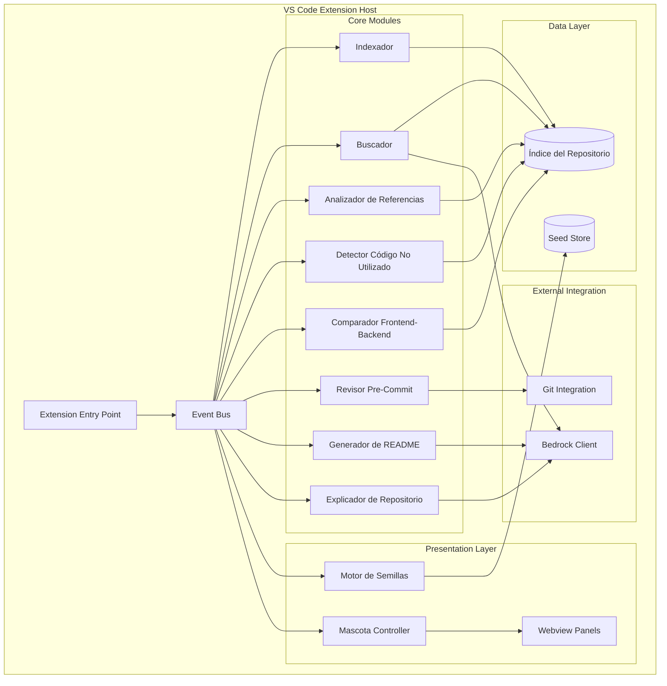

# Design Document

## Overview

Pluvianidae MVP es una extensión de VS Code que actúa como asistente inteligente de desarrollo para proyectos JavaScript/TypeScript (React, Node.js, Express). La arquitectura sigue un modelo de extensión modular donde un core orquesta módulos especializados (indexador, buscador, analizador, etc.) que operan sobre un índice centralizado del repositorio.

El sistema se integra con Amazon Bedrock para capacidades de lenguaje natural (búsqueda semántica, explicaciones, generación de README) y utiliza un paradigma de análisis estático basado en AST para inspección de código. Los hallazgos se presentan mediante un sistema gamificado de "semillas" y una mascota animada.

### Decisiones de diseño clave

- **Extensión VS Code**: Aprovecha la API de VS Code para integración profunda con el editor (file watchers, decoraciones, git, webviews).
- **Análisis basado en AST**: Se usa el parser de TypeScript (`typescript` compiler API) para extraer estructura del código, garantizando soporte unificado para JS/JSX/TS/TSX.
- **Índice en memoria con persistencia opcional**: El índice se mantiene en memoria durante la sesión y se serializa a disco solo con consentimiento del usuario.
- **Amazon Bedrock como servicio externo**: Todas las llamadas a Bedrock son opt-in con previsualización previa y fallback a búsqueda textual.
- **Arquitectura de eventos**: Los módulos se comunican mediante un bus de eventos interno para desacoplar lógica de análisis de presentación.

## Architecture



### Flujo de datos principal

1. **Indexación**: Al abrir un workspace, el Indexador parsea archivos JS/TS/JSX/TSX y construye el índice en memoria.
2. **Análisis bajo demanda**: El usuario invoca módulos de análisis que consultan el índice y generan hallazgos.
3. **Presentación**: Los hallazgos se transforman en semillas y se presentan mediante la mascota y webviews.
4. **Integración Bedrock**: Búsquedas semánticas y generación de texto pasan por el Bedrock Client con confirmación previa del usuario.

## Components and Interfaces

### 1. Extension Entry Point (`extension.ts`)

Punto de entrada de la extensión VS Code. Registra comandos, activa módulos y configura el bus de eventos.

```typescript
interface ExtensionContext {
  activate(context: vscode.ExtensionContext): void;
  deactivate(): void;
}
```

### 2. Event Bus (`core/event-bus.ts`)

Sistema de pub/sub interno para comunicación desacoplada entre módulos.

```typescript
interface IEventBus {
  emit(event: PluvianidaeEvent): void;
  on(eventType: string, handler: (event: PluvianidaeEvent) => void): Disposable;
  off(eventType: string, handler: (event: PluvianidaeEvent) => void): void;
}

type PluvianidaeEvent = 
  | { type: 'indexing:started'; payload: { totalFiles: number } }
  | { type: 'indexing:progress'; payload: { current: number; total: number; currentFile: string } }
  | { type: 'indexing:completed'; payload: { filesIndexed: number; errors: IndexError[] } }
  | { type: 'analysis:finding'; payload: Finding }
  | { type: 'seed:created'; payload: Seed }
  | { type: 'seed:updated'; payload: { id: string; newState: SeedState } }
  | { type: 'mascot:animate'; payload: MascotAnimation };
```

### 3. Indexador (`modules/indexer/`)

Analiza archivos del repositorio usando el compilador de TypeScript para extraer estructura.

```typescript
interface IIndexer {
  indexRepository(rootPath: string): Promise<IndexResult>;
  updateFile(filePath: string): Promise<void>;
  removeFile(filePath: string): void;
  getIndex(): RepositoryIndex;
}

interface IndexResult {
  filesProcessed: number;
  totalFiles: number;
  errors: IndexError[];
  duration: number;
}

interface IndexError {
  filePath: string;
  description: string;
  line?: number;
}
```

### 4. Buscador (`modules/searcher/`)

Procesa consultas en lenguaje natural usando Bedrock y consulta el índice.

```typescript
interface ISearcher {
  search(query: string): Promise<SearchResult[]>;
  searchExact(query: string): SearchResult[];
}

interface SearchResult {
  filePath: string;
  fullPath: string;
  symbolName: string;
  symbolType: SymbolType;
  codeSnippet: string; // máx 20 líneas
  explanation: string;
  relatedFiles: RelatedFile[];
}

interface RelatedFile {
  path: string;
  relationship: 'imports' | 'imported-by' | 'dependency';
}
```

### 5. Analizador de Referencias (`modules/reference-analyzer/`)

Construye mapa de referencias para símbolos.

```typescript
interface IReferenceAnalyzer {
  getReferences(symbol: SymbolIdentifier): Promise<ReferenceMap>;
}

interface ReferenceMap {
  definition: SymbolLocation;
  imports: SymbolLocation[];
  usages: SymbolUsage[];
  calls: SymbolLocation[]; // funciones invocadas directamente
  dependents: string[]; // archivos que dependen del símbolo
}

interface SymbolLocation {
  filePath: string;
  line: number;
  column: number;
}

interface SymbolUsage extends SymbolLocation {
  context: string; // fragmento de código alrededor del uso
}
```

### 6. Detector de Código No Utilizado (`modules/dead-code-detector/`)

Identifica código sin uso mediante análisis del grafo de dependencias.

```typescript
interface IDeadCodeDetector {
  analyze(): Promise<DeadCodeReport>;
}

interface DeadCodeReport {
  findings: DeadCodeFinding[];
  warnings: CodeWarning[];
  unanalyzableFiles: UnanalyzableFile[];
  duration: number;
}

interface DeadCodeFinding {
  type: 'unused-import' | 'unused-variable' | 'unused-parameter' | 'unused-function' | 'orphan-file';
  confidence: 'alto' | 'medio' | 'bajo';
  filePath: string;
  line: number;
  description: string;
  suggestedAction: 'eliminar' | 'comentar' | 'revisar-manualmente';
}

interface CodeWarning {
  type: 'commented-code' | 'duplicate-code';
  filePath: string;
  startLine: number;
  endLine: number;
  description: string;
  duplicateLocation?: { filePath: string; startLine: number; endLine: number };
}
```

### 7. Comparador Frontend-Backend (`modules/frontend-backend-comparator/`)

Analiza endpoints y llamadas HTTP para detectar incompatibilidades.

```typescript
interface IFrontendBackendComparator {
  analyze(): Promise<FBComparisonReport>;
}

interface FBComparisonReport {
  unconsumedEndpoints: UnconsumedEndpoint[];
  missingEndpoints: MissingEndpoint[];
  typeIncompatibilities: TypeIncompatibility[];
  discrepancies: Discrepancy[];
  unanalyzableFiles: UnanalyzableFile[];
}

interface UnconsumedEndpoint {
  route: string;
  method: HttpMethod;
  definitionFile: string;
  definitionLine: number;
}

interface MissingEndpoint {
  url: string;
  method: HttpMethod;
  callFile: string;
  callLine: number;
}

interface TypeIncompatibility {
  endpoint: string;
  backendExpected: string;
  frontendSends: string;
  backendLocation: SymbolLocation;
  frontendLocation: SymbolLocation;
}

interface Discrepancy {
  category: 'method-mismatch' | 'route-mismatch' | 'missing-field';
  sourceFile: string;
  sourceLine: number;
  description: string;
}
```

### 8. Revisor Pre-Commit (`modules/pre-commit-reviewer/`)

Ejecuta verificaciones sobre archivos en staging.

```typescript
interface IPreCommitReviewer {
  review(): Promise<PreCommitReport>;
}

interface PreCommitReport {
  findings: PreCommitFinding[];
  secretsDetected: SecretFinding[];
  skippedChecks: SkippedCheck[];
  stagedFiles: string[];
  timedOut: boolean;
  completedChecks: string[];
  incompleteChecks?: string[];
}

interface PreCommitFinding {
  severity: 'error' | 'advertencia' | 'recomendación';
  checkType: string;
  filePath: string;
  line: number;
  description: string;
}

interface SecretFinding {
  filePath: string;
  line: number;
  pattern: string; // tipo de secreto detectado
}

interface SkippedCheck {
  name: string;
  reason: string;
}
```

### 9. Generador de README (`modules/readme-generator/`)

Produce borradores de README basados en análisis del repositorio.

```typescript
interface IReadmeGenerator {
  generateDraft(): Promise<ReadmeDraft>;
  applyDraft(draft: ReadmeDraft): Promise<void>;
}

interface ReadmeDraft {
  content: string;
  sections: ReadmeSection[];
  omittedSections: OmittedSection[];
  diff?: string; // diferencias con README existente
}

interface ReadmeSection {
  title: string;
  content: string;
}

interface OmittedSection {
  title: string;
  reason: string;
}
```

### 10. Motor de Semillas (`modules/seed-engine/`)

Gestiona el ciclo de vida de hallazgos gamificados.

```typescript
interface ISeedEngine {
  createSeed(finding: Finding): Seed;
  updateState(seedId: string, newState: SeedState): Seed;
  getPendingSeeds(): Seed[];
  getSeedDetail(seedId: string): Seed | undefined;
  getAllSeeds(): Seed[];
}

type SeedState = 'Pendiente' | 'En revisión' | 'Resuelta' | 'Ignorada';

interface Seed {
  id: string;
  type: 'recomendación' | 'tip' | 'problema' | 'review';
  sourceModule: string;
  location?: SymbolLocation;
  description: string;
  suggestedAction?: string;
  state: SeedState;
  createdAt: Date;
  updatedAt: Date;
}

// Transiciones válidas
const VALID_TRANSITIONS: Record<SeedState, SeedState[]> = {
  'Pendiente': ['En revisión', 'Resuelta', 'Ignorada'],
  'En revisión': ['Resuelta', 'Ignorada'],
  'Resuelta': [],
  'Ignorada': [],
};
```

### 11. Mascota Controller (`modules/mascot/`)

Controla las animaciones y posicionamiento de la mascota.

```typescript
interface IMascotController {
  show(): void;
  hide(): void;
  animate(animation: MascotAnimation): void;
  positionNear(filePath: string): void;
}

type MascotAnimation = 
  | { type: 'idle' }
  | { type: 'analysis-complete' }
  | { type: 'carrying-seed' }
  | { type: 'celebration' }
  | { type: 'perch-on-file'; filePath: string };
```

### 12. Bedrock Client (`services/bedrock-client.ts`)

Wrapper para comunicación con Amazon Bedrock con confirmación del usuario.

```typescript
interface IBedrockClient {
  query(prompt: string, context: BedrockContext): Promise<string>;
  isAvailable(): Promise<boolean>;
}

interface BedrockContext {
  files: string[];
  codeSnippets: string[];
  requiresConfirmation: boolean;
}
```

### 13. Security Filter (`services/security-filter.ts`)

Filtra archivos sensibles y redacta valores en reportes.

```typescript
interface ISecurityFilter {
  shouldExclude(filePath: string): boolean;
  getExclusionPatterns(): string[];
  addUserExclusion(pattern: string): void;
  redactSensitiveValues(content: string): string;
}
```

## Data Models

### Repository Index

```typescript
interface RepositoryIndex {
  rootPath: string;
  files: Map<string, FileEntry>;
  symbols: Map<string, SymbolEntry>;
  importGraph: Map<string, string[]>; // filePath -> [imported file paths]
  exportGraph: Map<string, ExportedSymbol[]>;
  endpoints: EndpointEntry[];
  lastUpdated: Date;
}

interface FileEntry {
  path: string;
  relativePath: string;
  extension: string;
  lastModified: Date;
  symbols: string[]; // IDs de símbolos en este archivo
  imports: ImportEntry[];
  exports: ExportEntry[];
}

interface SymbolEntry {
  id: string;
  name: string;
  type: SymbolType;
  filePath: string;
  line: number;
  column: number;
  endLine: number;
  parameters?: ParameterInfo[];
  returnType?: string;
}

type SymbolType = 'function' | 'class' | 'component' | 'variable' | 'type' | 'interface' | 'enum' | 'endpoint';

interface ImportEntry {
  source: string; // módulo importado
  specifiers: string[]; // símbolos importados
  isDefault: boolean;
  line: number;
}

interface ExportEntry {
  name: string;
  isDefault: boolean;
  line: number;
}

interface ExportedSymbol {
  name: string;
  filePath: string;
  isDefault: boolean;
}

interface EndpointEntry {
  route: string;
  method: HttpMethod;
  filePath: string;
  line: number;
  parameters: ParameterInfo[];
  bodySchema?: TypeSchema;
  responseSchema?: TypeSchema;
}

type HttpMethod = 'GET' | 'POST' | 'PUT' | 'DELETE' | 'PATCH';

interface ParameterInfo {
  name: string;
  type: string;
  required: boolean;
  source: 'query' | 'params' | 'body' | 'header';
}

interface TypeSchema {
  type: string;
  properties?: Record<string, TypeSchema>;
  required?: string[];
}
```

### Seed Store

```typescript
interface SeedStore {
  seeds: Map<string, Seed>;
  save(): Promise<void>;
  load(): Promise<void>;
}
```

### Configuration

```typescript
interface PluvianidaeConfig {
  excludePatterns: string[];
  bedrockRegion: string;
  bedrockModelId: string;
  enableMascot: boolean;
  confirmBeforeTransmit: boolean;
  persistIndex: boolean;
  maxIndexingTime: number;
  maxPreCommitTime: number;
}
```


## Correctness Properties

*A property is a characteristic or behavior that should hold true across all valid executions of a system—essentially, a formal statement about what the system should do. Properties serve as the bridge between human-readable specifications and machine-verifiable correctness guarantees.*

### Property 1: File extension and exclusion filtering

*For any* directory tree containing files with various extensions and dependency folders (node_modules, bower_components, .pnp), the Indexador SHALL include only files with extensions .js, .jsx, .ts, .tsx and SHALL exclude all files within dependency folders.

**Validates: Requirements 1.1**

### Property 2: Symbol extraction completeness

*For any* valid JavaScript/TypeScript source file containing functions, components, classes, imports, exports and endpoints, the Indexador SHALL extract every defined symbol such that each symbol in the source appears in the index output.

**Validates: Requirements 1.2**

### Property 3: Gitignore pattern exclusion

*For any* .gitignore file with valid patterns and any file path in the repository, the Indexador SHALL exclude the file if and only if it matches at least one pattern in the .gitignore.

**Validates: Requirements 1.3**

### Property 4: Sensitive file exclusion

*For any* file path, the SecurityFilter SHALL exclude it from all analysis processes if and only if it matches one of the defined sensitive patterns (.env*, *.pem, *.key, *.cert, *.p12, credentials.json, *secret*, .ssh/*, .aws/*) or a user-configured custom exclusion pattern.

**Validates: Requirements 1.4, 11.1, 11.2**

### Property 5: Error resilience across modules

*For any* set of files where some contain syntax errors, all analysis modules (Indexador, Detector, Comparador) SHALL process all valid files successfully, log errors for unprocessable files, and produce correct results for the processable subset.

**Validates: Requirements 1.6, 4.5, 5.7**

### Property 6: Incremental index consistency

*For any* initial repository index and any file change (create, modify, delete), after incremental update the index SHALL be equivalent to a full re-indexation of the repository's current state, and only the affected files SHALL have been reprocessed.

**Validates: Requirements 1.7**

### Property 7: Search result completeness

*For any* search result returned by the Buscador, the result SHALL contain: a non-empty file name, full path, symbol name, code snippet of at most 20 lines, and explanation text.

**Validates: Requirements 2.2**

### Property 8: Related files from import graph

*For any* search result with an associated file, the related files list SHALL contain exactly those files that have a direct import/dependency relationship with the result file according to the repository index import graph.

**Validates: Requirements 2.3**

### Property 9: Reference map completeness

*For any* symbol present in the repository index, the Analizador_De_Referencias SHALL return a reference map where: (a) the definition location matches the symbol's indexed position, (b) the imports list contains all files that import this symbol, (c) the usages list contains all locations where the symbol is referenced, (d) for functions, the calls list contains all functions directly invoked, and (e) the dependents list contains all files depending on this symbol.

**Validates: Requirements 3.1, 3.2, 3.3, 3.4, 3.5**

### Property 10: Dead code detection accuracy

*For any* repository with known unused symbols (imports not referenced, variables never read, functions never invoked, files not imported by any other file), the Detector SHALL identify all truly unused symbols and SHALL assign confidence levels correctly: "alto" when zero references exist, "medio" when referenced only in comments or tests, "bajo" when referenced dynamically or indirectly.

**Validates: Requirements 4.1, 4.2**

### Property 11: Commented and duplicate code thresholds

*For any* code block, the Detector SHALL flag it as a warning if and only if it is a commented block of 3 or more consecutive lines OR a block of 5 or more lines with at least 80% similarity to another block in the repository, and all such warnings SHALL have confidence "bajo".

**Validates: Requirements 4.3**

### Property 12: Backend endpoint extraction

*For any* Express/Node.js route definition containing a route path, HTTP method, parameters, body schema, and response types, the Comparador SHALL extract all these properties correctly with their file locations.

**Validates: Requirements 5.1**

### Property 13: Frontend API call extraction

*For any* frontend code containing HTTP calls (fetch, axios, custom hooks), the Comparador SHALL identify the URL, HTTP method, sent data types, and file location of each call.

**Validates: Requirements 5.2**

### Property 14: Connection mismatch detection

*For any* set of backend endpoints and frontend HTTP calls, the Comparador SHALL report every endpoint without a matching frontend consumer as "unconsumed" and every frontend call without a matching backend endpoint as "missing endpoint".

**Validates: Requirements 5.3, 5.4**

### Property 15: Type and method incompatibility detection

*For any* pair of matching frontend call and backend endpoint, if the types sent by the frontend differ from those expected by the backend, or if HTTP methods or route patterns differ, the Comparador SHALL report each discrepancy with locations of both sides.

**Validates: Requirements 5.5, 5.6**

### Property 16: Pre-commit finding classification

*For any* finding generated by the Revisor_Pre_Commit, it SHALL be classified as exactly one of: "error" (prevents compilation/execution), "advertencia" (quality issue), or "recomendación" (optional improvement), and SHALL include: check type, file path, line number, and description.

**Validates: Requirements 6.2**

### Property 17: Secret pattern detection

*For any* file content containing strings matching API key, token, password, or private key patterns, the Revisor_Pre_Commit SHALL detect all matches and the presence of any secret SHALL trigger commit blocking.

**Validates: Requirements 6.3**

### Property 18: Seed state machine validity

*For any* Seed and any attempted state transition, the transition SHALL succeed if and only if it follows valid paths: Pendiente→{En revisión, Resuelta, Ignorada}, En revisión→{Resuelta, Ignorada}. No other transitions SHALL be permitted, and seeds SHALL always be in one of the four valid states.

**Validates: Requirements 9.2, 9.4**

### Property 19: Seed creation completeness

*For any* finding generated by the system, the Motor_De_Semillas SHALL create a Seed with: initial state "Pendiente", the finding's type, source module, location (when applicable), description, and a creation timestamp.

**Validates: Requirements 9.1**

### Property 20: Pending seed count consistency

*For any* collection of seeds, the displayed pending count SHALL equal the exact number of seeds currently in state "Pendiente".

**Validates: Requirements 9.5**

### Property 21: Mascot carrying-seed indicator

*For any* state of the seed collection, the Mascota SHALL display the carrying-seed visual if and only if there exists at least one seed in state "Pendiente".

**Validates: Requirements 9.6**

### Property 22: Animation queue ordering

*For any* sequence of events received by the Mascota simultaneously or in rapid succession, the Mascota SHALL process all animations in their arrival order without omitting any event.

**Validates: Requirements 10.7**

### Property 23: Sensitive value redaction

*For any* report content containing tokens, passwords, API keys, or connection strings, the Sistema SHALL replace all sensitive values with a redaction indicator such that the original value is neither visible nor partially reconstructible from the output.

**Validates: Requirements 11.5**

### Property 24: README diff generation

*For any* existing README and proposed README draft, the Generador SHALL produce a correct diff showing all additions, removals, and modifications between the two documents.

**Validates: Requirements 7.4**

### Property 25: README section omission for missing data

*For any* repository structure that lacks information for a README section (e.g., no endpoints, no environment variables), the Generador SHALL omit that section from the draft and include the section name in the list of omitted sections reported to the user.

**Validates: Requirements 7.5**

## Error Handling

### Estrategia general

El sistema sigue un patrón de **degradación elegante**: cuando un componente falla, los demás continúan operando y el usuario recibe información clara sobre qué falló y por qué.

### Errores de parseo/sintaxis

| Módulo | Comportamiento |
|--------|---------------|
| Indexador | Registra error con nombre de archivo y descripción. Continúa con archivos restantes. El archivo queda fuera del índice. |
| Detector de Código No Utilizado | Registra archivo como "no analizable". Reporta al usuario. Continúa análisis. |
| Comparador Frontend-Backend | Registra archivo con razón del fallo. Continúa análisis con archivos disponibles. |

### Errores de servicio externo (Amazon Bedrock)

- **Timeout (>10s)**: Informar al usuario. Ofrecer alternativa (búsqueda textual en caso del Buscador, reintento en caso de explicación/README).
- **Servicio no disponible**: Mismo tratamiento que timeout.
- **Error de respuesta**: Loguear internamente, informar al usuario con mensaje genérico.

### Errores de timeout internos

| Módulo | Timeout | Comportamiento |
|--------|---------|---------------|
| Revisor Pre-Commit | 60s | Presentar resultados parciales. Listar verificaciones incompletas. |
| Generador de README | 30s | Informar al usuario. Ofrecer reintento. |
| Explicador de Repositorio | 15s | Informar al usuario. Ofrecer reintento. |
| Indexación incremental | 5s/archivo | Loguear como parcialmente indexado. Reintentar en siguiente cambio. |

### Errores de permisos y filesystem

- **Archivo no legible**: Omitir del análisis. Registrar en errores del índice.
- **No se puede escribir archivo**: Informar al usuario. No reintentar automáticamente.

### Secretos detectados en pre-commit

- **Comportamiento crítico**: Bloquear commit automáticamente.
- **Requerir acción explícita del usuario**: Continuar (con riesgo asumido) o cancelar.
- **No incluir los valores detectados en ningún log o reporte**.

### Patrón de error en reportes

Todos los reportes de error siguen la estructura:

```typescript
interface AnalysisError {
  module: string;
  filePath: string;
  description: string;
  severity: 'fatal' | 'recoverable' | 'warning';
  timestamp: Date;
}
```

## Testing Strategy

### Enfoque dual de testing

La estrategia de testing combina:

1. **Tests unitarios (example-based)**: Para escenarios específicos, edge cases, integraciones y flujos de UI.
2. **Tests de propiedades (property-based)**: Para validar invariantes universales sobre toda la entrada posible.

### Property-Based Testing

**Biblioteca**: [fast-check](https://github.com/dubzzz/fast-check) para TypeScript/JavaScript.

**Configuración**: Cada test de propiedad ejecutará un mínimo de 100 iteraciones.

**Tagging**: Cada test incluirá un comentario con formato:
```
// Feature: pluvianidae-mvp, Property {N}: {property_text}
```

**Propiedades a implementar** (referenciadas del documento de diseño):
- Property 1-6: Módulo Indexador (filtrado, extracción, exclusión, resiliencia, incremental)
- Property 7-8: Módulo Buscador (completeness, related files)
- Property 9: Módulo Analizador de Referencias (mapa completo)
- Property 10-11: Módulo Detector de Código No Utilizado (accuracy, thresholds)
- Property 12-15: Módulo Comparador Frontend-Backend (extraction, mismatch, compatibility)
- Property 16-17: Módulo Revisor Pre-Commit (classification, secret detection)
- Property 18-22: Motor de Semillas y Mascota (state machine, creation, count, indicator, queue)
- Property 23: Security Filter (redaction)
- Property 24-25: Generador de README (diff, omission)

### Unit Tests (Example-Based)

Cubren los criterios clasificados como EXAMPLE, EDGE_CASE e INTEGRATION:

- **Buscador**: Sin resultados → sugerencias (2.4), fallback a texto cuando Bedrock no disponible (2.6)
- **Analizador de Referencias**: Símbolo no encontrado → mensaje con causas (3.6)
- **Detector**: Confirmación antes de aplicar correcciones (4.4)
- **Revisor Pre-Commit**: Verificaciones omitidas con razón (6.4)
- **Generador de README**: Confirmación de borrador (7.2), rechazo preserva existente (7.3)
- **Explicador**: Repositorio sin frontend/backend (8.4), Bedrock no disponible (8.5)
- **Semillas**: Transición individual (9.3), detalle completo (9.7)
- **Mascota**: Posicionamiento (10.1), animaciones con duración (10.2, 10.5), ocultar/restaurar (10.6)
- **Seguridad**: Confirmación antes de enviar a Bedrock (11.3), cancelación (11.4), confirmación antes de modificar archivos (11.6)

### Integration Tests

- Flujo completo de indexación → búsqueda → resultados
- Pre-commit con git staging area real
- Conexión con Amazon Bedrock (con mocks para CI, real para staging)
- File watcher → incremental indexing

### Smoke Tests

- Extensión se activa correctamente en VS Code
- Comandos registrados y accesibles
- No persistencia de código tras sesión (11.7)

### Estructura de tests

```
tests/
├── unit/
│   ├── indexer/
│   ├── searcher/
│   ├── reference-analyzer/
│   ├── dead-code-detector/
│   ├── frontend-backend-comparator/
│   ├── pre-commit-reviewer/
│   ├── readme-generator/
│   ├── seed-engine/
│   ├── mascot/
│   └── security-filter/
├── property/
│   ├── indexer.property.test.ts
│   ├── searcher.property.test.ts
│   ├── reference-analyzer.property.test.ts
│   ├── dead-code-detector.property.test.ts
│   ├── frontend-backend.property.test.ts
│   ├── pre-commit.property.test.ts
│   ├── seed-engine.property.test.ts
│   ├── mascot.property.test.ts
│   ├── security-filter.property.test.ts
│   └── readme-generator.property.test.ts
├── integration/
│   ├── indexing-flow.test.ts
│   ├── bedrock-integration.test.ts
│   └── git-integration.test.ts
└── smoke/
    └── extension-activation.test.ts
```

### Herramientas

- **Test runner**: Vitest (compatible con VS Code extension testing)
- **Property testing**: fast-check
- **Mocking**: vitest built-in mocks + msw para HTTP
- **Coverage target**: 80% líneas en módulos core
